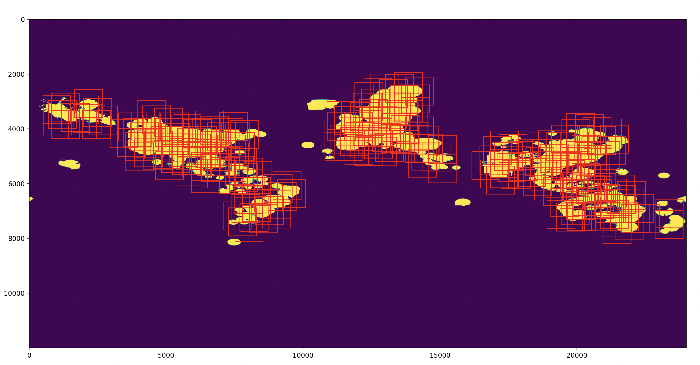

# Meteonet

## Table of Contents

  - [Abstract](#abstract)
  - [Introduction](#introduction) 
  - [Implementation](#implementation)
  - [Data](#data)
    - [Preparation](#preparation)
      - [Tile preparation](#tile-preparation)
      - [Dataset preparation](#dataset-preparation)
      - [Dataset loading](#dataset-loading)
  - [Training](#training)
  - [Prediction](#prediction)
  - [DEMO](#demo)
  - [Conclusion](#conclusion)


## Abstract

Here I present a neural network capable of predicting weather radar images. The network is capable of predicting weather conditions 2 hours in advance using a sequence of 12 radar images with a time stride of 10 minutes. The prediction is based on the data from the previous 2 hours.

## Introduction
Weather nowcasting is the prediction of weather conditions in the near future. It is a challenging task due to the complexity of the atmosphere and the large number of variables that affect the weather. The prediction of weather radar images is a particularly difficult task due to the high spatial and temporal variability of the atmosphere. 


In past years, multiple methods of weather radar nowcasting have been presented. One of older algorithms is the SWIRLS. The full name of "SWIRLS" is "Short-range Warning of Intense Rainstorms in Localized Systems". It is a nowcasting system developed and operated by HKO since 1999. More recently, methods based on optical flow have been presented and even more recently, methods based on neural networks have been presented.

In this project, I present a neural network based on Visual Transformer model capable of predicting weather radar images. The specific visual transformer model is taken from PVDM ([Yu et al., 2023](https://github.com/sihyun-yu/PVDM)). Authors in PVDM project are presenting a method for video generation composed of two components. Firstly a autoencoder (temporal visual transformer) used for encoding/decoding videos from/to latent space. Secondly a diffusion model used for latent space sampling procedure to synthesize videos of arbitrary length. 

## Implementation
Meteonet autoencoder implementation is highly based on PVDM project. The main difference is that the autoencoder is used for weather radar images prediction. And the diffusion model is not used in this project. The prediction is therefore handled by the autoencoder itself.

I've added the data processing pipeline and the logic for predicting whole world radar nowcast.


### Vit autoencoder

In order to integrate the PVDM's autoencoder into the Meteonet project I've made slight changes into the original code. The main change is connected with the fact that the autoencoder now performs the prediction. This mean that the input and output of the autoencoder are not the same. The input is a sequence of radar images and the output is a predicted radar images. The number, resolution and channels of the input and output images are the same. 

### Data 

Crucial part of every machine learning project is the data. In this project I've used the data from [RainViewer](https://www.rainviewer.com/api.html) weather radar. The raw data which I've been then processing are the whole world weather radar images in highest possible resolution (24000px wide). The data is available in 10 minutes time steps. 

#### Preparation
Since the data are images of the whole world, the resolution of the image is very high. The images are 24000px wide and 12000px high. In order to prepare the data for the neural network. The images must split into smaller tiles. The tiles are then used as the input for the neural network. The tile resolution used for dataset preparation is 1024x1024px.

##### Tile preparation
Tile preparation consists of those steps. Since the RainViewer provides the weather radar coverage map. The tiles are generated only for the areas where the radar coverage is present. Tiles are generated randomly with multiple parameters which each tile must satisfy. The parameters are the following: 
  - minimal coverage: the minimal percentage of the tile which must be covered by the radar coverage map
  - maximal Intersection over Union (IoU) threshold: the maximal IoU between the new tile and the already generated tiles

By this method, I've generated 2000 tiles which will be used as the input for dataset preparation. Example of the generated tiles is shown in the following figure:

<center>

</center>

This process is covered by the `data/tile_gen.py` script.
 
 ``` bash
 python3 tile_gen.py --image ../0_0.png --tile_size 1024
 ```
 0_0.png is coverage map image.

##### Dataset preparation
The dataset preparation is the process of creating the dataset from weather radar images using the generated tiles. The dataset is created by cutting the weather radar images into the tiles and then saving the tiles as separate images. By this process, I've created a dataset consisting of long time series data (multiple months) for each tile.

Second stage of dataset preparation is filtering of mostly empty images. By the nature of weather radar imaging, the images are very often empty or contain only a small amount of data. The filtering process is based on the percentage of the image which is covered by the radar coverage map. The images with less than 15% coverage are filtered out.

By this time the images are ready for training.

##### Dataset loading
Since the input network is sequence of images, the dataset loader scans the dataset and creates the set of uninterrupted image sequences of specified length. 

The sequence is then loaded images are downscaled to 256x256px and normalized to the range of -1 to 1. The downscale is necessary for the network to be able to process the data in reasonable time. At the and it is expected to upscale the images back by srgan or similar method.

### Training
Since I based the Meteonet on the PVDM project, the training process is mostly the same except minor facts. I am using only the Vit autoencoder part of the PVDM and even it is edited in order to support sequence to sequence prediction, which means that the input and output of the network are not the same. The input is a sequence of radar images and the output is a predicted radar images. 

When training meteonet I've used pretrained weights from the PVDM project and only omitted the input and output layer of the network, because of different dimensionality. The input and output layer are then trained from scratch. Hence the --partial-load argument in the training script.

The training duration is thanks to using pretrained weights significantly shorter than training and in the end the whole network is trained in scope of 2 days on a single GPU (Nvidia A100 40GB).

The training command is the following:

``` bash
# First you need to have dataset prepared. Sample dataset is in repository. Just extract the sample_dataset.tar.xz file.
python3.10 train.py --data-path sample_dataset --partial-load --checkpoint pvdm_pretrained_model.pth
```

This command will train the network on the sample dataset and generate the model weights pth file.

**Note:** If you want to get access to dataset which I've used for training, please contact me.

### Prediction
The main outcome of this work is working prediction of weather radar for whole world for next several hours. The core of the prediction is the trained neural network, which is only capable of predicting single tile at the time. But the world is much bigger than single tile can cover. The prediction is therefore handled an additional algorithm which is responsible for blending the predicted tiles into one image of the whole world.

Mechanism behind the prediction is the following:
Precursors:
  - We have 12 past radar images of whole world. I have been working with data from [RainViewer](https://www.rainviewer.com/api.html) which provides the weather radar images in 10 minutes time steps.
  - We have the coverage map of the radar coverage.
  - We have trained neural network capable of predicting the weather radar images for the next 2 hours. (The training section above.)

Prediction:
  - The world map needs to divided into multiple sets of tiles. Tile size is 256x256px. (Prepared tiles are in repository in `inference_tiles.json`.) 
    - First tile set is a set of tiles which divides the world without any starting offset.
    - Second tile set is a set of tiles which divides the world with 128px (half of tile size) offset in x axis.
    - Third tile set is a set of tiles which divides the world with 128px (half of tile size) offset in y axis.
    - Fourth tile set is a set of tiles which divides the world with 128px (half of tile size) offset in x and y axis.
  The logic behind the tile sets is to cover the whole world with the tiles and also to cover situations that happening on tile crossing. Lets say there is a cloud which is transitioning from one tile to another. Without intersecting tile the information transfer would be impossible.
  - We will extract image sequences per tile and filter out those which are mostly empty, to speed up the prediction.
  - We will use the model to perform the prediction for every prepared tile.
  - Now only thing we need to do is to blend images into single image.
  - The blending process is based on the fact that the tiles are overlapping, Which means that we have a multilayered image. The blending process itself takes a median pixel value from all layers. 

### DEMO
And now stop with those blank words and let's see the prediction in action. Here I present multiple single tile predictions (in form of gif image) where the past (input data) as well as the unseen reality (ground truth) are shown. The prediction is based on the past 12 radar images with a time stride of 10 minutes. 

<center>

</center>

## Conclusion
In this project, I've presented a neural network adapted from PVDM project capable of predicting weather radar images. Trained model files as well as all necessary scripts are available in the repository. Please not that this was my **hobby** project and therefore it is not perfect and can be improved in many ways. If you have any questions or you want to get access to the dataset, please contact me via github issues or email.

Thank you for reading.

Jan Jurča